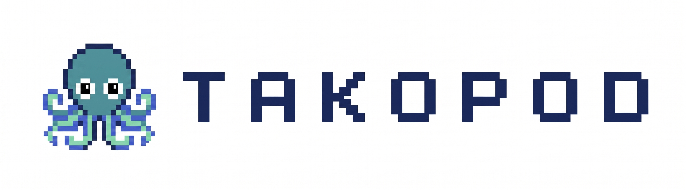

# takopod

<p style="text-align: center;">
  
</p>

A multi-agent AI platform where each agent runs in an isolated Podman container with persistent memory, file workspace, and real-time streaming chat. Agents are powered by Claude (via Vertex AI) and can be extended with MCP servers and integrations.

## Features

### Core Platform

- **Multi-agent support** — Create and manage multiple AI agents, each with its own identity, personality, and persistent memory. Agents are aware of each other and can be configured independently.
- **Container isolation** — Each agent runs in a rootless Podman container with capped memory (2 GB), CPU (2 cores), and PID limits (256). The worker process never sees integration credentials — all MCP servers and external service tokens stay on the host side of the IPC boundary.
- **Real-time streaming chat** — WebSocket-based UI with streaming token output, tool call visibility, and approval prompts for sensitive operations.
- **Persistent memory** — Conversations are summarized on context overflow, stored as daily memory files, and indexed for hybrid search (BM25 keyword + vector similarity via Ollama embeddings). Structured facts are extracted from sessions and tracked with supersession history to power a learning loop.
- **Scheduled tasks** — Create recurring tasks with interval, file-watch, or webhook triggers. Tasks run in ephemeral containers with full agent capabilities. Webhook example:
  ```bash
  curl -X POST http://localhost:8000/api/agents/{agent_id}/trigger/{task_id} \
    -H "Authorization: Bearer {token}" \
    -H "Content-Type: application/json" \
    -d '{"repo": "quay/quay", "pr": 5805, "check": "unit-tests", "status": "failed"}'
  ```
  The agent wakes up with its original prompt enriched with the webhook payload. Works with GitHub Actions, Jenkins, PagerDuty — anything that can send an HTTP POST.
- **Skills** — Markdown instruction files that guide agent behavior. Builtin skills (schedule, Slack, Jira) ship with the platform; agents can also create their own.
- **Session continuity** — On context overflow (80% of the 200K context window), the session splits transparently: the conversation is summarized, a continuation context is injected into the next session, and the user sees no interruption.

### Integrations

- **Slack** — Builtin MCP server. Read channels and DMs, search messages, send notes to yourself, and monitor Slack threads in real time (new replies are injected into the agent's chat). Requires a Slack user token and cookie.
- **GitHub** — Builtin MCP server wrapping the `gh` CLI. Read and manage PRs, issues, releases, workflows, and gists. Commands are classified into auto-approved, user-approval-required, and denied tiers for safety.
- **Jira** — Supported via [mcp-atlassian](https://github.com/sooperset/mcp-atlassian). Add it as a custom MCP server (see [Adding MCP Servers](#adding-mcp-servers)) with your Atlassian credentials. A bundled Jira skill teaches the agent JQL queries, issue management, and sprint tracking.
- **Google Workspace** — Builtin MCP server wrapping the [`gws` CLI](https://github.com/nicholasgasior/gws). Access Drive, Sheets, Gmail, Calendar, Docs, Slides, Tasks, People, Chat, and Forms.
- **Custom MCP servers** — Add any MCP-compatible server (stdio or HTTP with OAuth) through the UI. The orchestrator manages server lifecycle, tool discovery, and credential storage. Workers call MCP tools through a file-based proxy — credentials never enter the container.

### Credential Isolation

Integration credentials (Slack tokens, GitHub auth, OAuth tokens, API keys) are stored and used exclusively on the host by the orchestrator process. Worker containers interact with external services only through a file-based IPC proxy: the worker writes a tool-call request to `request.json`, the orchestrator executes it with the real credentials, and writes the result to `response.json`. The worker never sees tokens, cookies, or API keys. This is a deliberate security boundary — even a fully compromised worker container cannot exfiltrate credentials.

## Prerequisites

### Python 3.12+

Verify with `python3 --version`. Install via your OS package manager or [python.org](https://www.python.org/downloads/).

### uv (Python package manager)

```bash
curl -LsSf https://astral.sh/uv/install.sh | sh
```

See [uv installation docs](https://docs.astral.sh/uv/getting-started/installation/) for other methods.

### Node.js 22+ and npm

Required for building the web UI. Install via [nvm](https://github.com/nvm-sh/nvm) (recommended) or [nodejs.org](https://nodejs.org/).

```bash
# via nvm
nvm install 22
nvm use 22
```

### Podman

Used for running agent containers and the Ollama embedding service.

- **macOS**: Install [Podman Desktop](https://podman-desktop.io/) — this installs the Podman CLI to `/opt/podman/bin/podman`, which is the path takopod expects.
- **Linux**: Install via your package manager (`sudo apt install podman` / `sudo dnf install podman`). You may need to symlink or update the path — the Makefile currently hardcodes `/opt/podman/bin/podman`.

After installing, initialize and start the Podman machine (macOS only):

```bash
podman machine init
podman machine start
```

### Google Cloud credentials (Vertex AI)

Agent containers use Claude via Vertex AI. You need authenticated GCP credentials:

```bash
gcloud auth application-default login
```

This populates `~/.config/gcloud/`, which is mounted read-only into each worker container. Set the following environment variables to point at your GCP project:

- `GOOGLE_CLOUD_PROJECT` — your GCP project ID
- `GOOGLE_CLOUD_REGION` — GCP region to use

### GitHub CLI (optional)

Required for the GitHub integration. Install and authenticate:

```bash
# macOS
brew install gh

# Linux (Debian/Ubuntu)
sudo apt install gh

# Authenticate
gh auth login
```

### Google Workspace CLI (optional)

Required for the Google Workspace integration. See [`gws` installation](https://github.com/nicholasgasior/gws) for setup, then authenticate with `gws auth login`.

## Setup

1. Clone the repository and `cd` into it.

2. Run the full build (installs Python and Node dependencies, builds the worker container image, and builds the web UI):

```bash
make
```

This runs three targets in sequence:
- `make install` — `uv sync` (creates `.venv/` and installs Python deps) + `npm install` in `web/`
- `make build-worker` — builds the `takopod-worker` Podman image from `worker/Containerfile`
- `make web-ui` — runs `npm run build` in `web/`

3. Set up the Ollama embedding service (optional but recommended):

```bash
make setup-ollama
```

This pulls the Ollama container image and downloads the `nomic-embed-text` model. Ollama provides hybrid BM25 + vector search for agent memory. If you skip this, set `OLLAMA_ENABLED=false` as an environment variable before starting.

## Running

### Start Ollama (if using embeddings)

```bash
make start-ollama
```

This starts the Ollama container on the `takopod-internal` Podman network with 4 GB memory and 2 CPUs. The network is created automatically by the orchestrator on first start.

### Start takopod

```bash
source .venv/bin/activate
takopod start
```

The service runs on `http://localhost:8000` by default. Logs are written to `data/takopod.log`.

Options:

```bash
takopod start --host 127.0.0.1 --port 9000
```

### Check status

```bash
takopod status
```

Shows the running PID, schema version, and managed container count.

### Stop

```bash
takopod stop
```

To stop Ollama separately:

```bash
make stop-ollama
```

### Development mode

For development with auto-reload, build the worker image and start uvicorn directly:

```bash
make dev
```

For frontend development with hot module replacement:

```bash
cd web
npm run dev
```

## Adding MCP Servers

### Via the UI

Open the System MCP view in the web UI. Add a server with:
- **Name** — identifier for the server
- **Transport** — `stdio` (local process) or `http` (remote, supports OAuth)
- **Command / URL** — the server command or endpoint URL

Once added, enable the server per-agent from the agent's MCP panel.

### Example: Jira via mcp-atlassian

1. Install mcp-atlassian:

```bash
uvx mcp-atlassian
```

2. In the takopod UI, go to System MCP and add a server:
   - **Name**: `jira`
   - **Transport**: `stdio`
   - **Command**: `uvx mcp-atlassian --jira-url https://your-org.atlassian.net --jira-username your@email.com --jira-token YOUR_API_TOKEN`

3. Enable the Jira MCP server and the Jira skill for your agent.

The agent will have access to Jira tools (create/update/search issues, manage sprints, JQL queries) guided by the builtin Jira skill.

## Environment Variables

All optional. Defaults work for standard setups.

- `GOOGLE_CLOUD_PROJECT` — GCP project ID for Vertex AI
- `GOOGLE_CLOUD_REGION` — GCP region for Vertex AI
- `OLLAMA_ENABLED` — Enable/disable Ollama embeddings (default: `true`)
- `OLLAMA_HOST_URL` — Ollama endpoint for the orchestrator (default: `http://localhost:11434`)
- `SHUTDOWN_TIMEOUT_SECONDS` — Graceful shutdown timeout (default: `30`)
- `IDLE_TIMEOUT_SECONDS` — Container idle reaper timeout (default: `300`)

### Slack integration (optional)

To enable Slack monitoring, set these before starting:

- `SLACK_XOXC_TOKEN` — Slack user token (`xoxc-...`)
- `SLACK_D_COOKIE` — Slack auth cookie (`xoxd-...`)
- `MY_MEMBER_ID` — Your Slack user ID (`U...`)

## Architecture

See `ARCHITECTURE.md` for the full system design.

Each agent runs in an isolated Podman container with a bind-mounted workspace directory (`data/agents/<agent-id>/`). The orchestrator and worker communicate via four JSON files, using atomic writes (temp file + fsync + rename) and poll-based consumption.

### IPC Channels

Message channel (user conversations):

- `input.json`: Orchestrator writes batched messages, worker reads and deletes (ACK).
- `output.json`: Worker writes streaming events (tokens, tool calls, completion), orchestrator reads and deletes.

Tool channel (worker requests to orchestrator):

- `request.json`: Worker writes a request (e.g., schedule CRUD, MCP tool call), orchestrator reads and deletes.
- `response.json`: Orchestrator writes the result, worker reads and deletes.

Each agent has its own set of these four files in its own workspace directory. A dedicated orchestrator polling loop (asyncio task, 0.5s tick) watches each agent's directory independently. The tool channel polls at 0.1s for lower latency.
